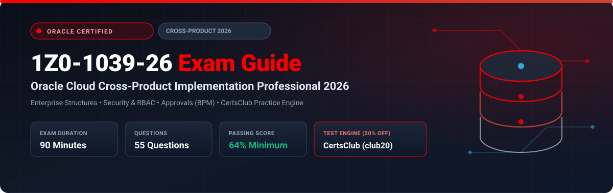

  

# Oracle Cloud Cross-Product Implementation Professional 2026 (1Z0-1039-26) Exam Study Guide & Practice Test Resource Portal

[-f80000?style=for-the-badge&logo=oracle&logoColor=white)](https://education.oracle.com/)

[-28a745?style=for-the-badge&logo=shield)](https://www.certsclub.com/oracle/)

---

## 1. Exam Overview & Candidate Profile

The **Oracle Cloud Cross-Product Implementation Professional 2026 (1Z0-1039-26)** exam validates that a consultant can architect and execute foundational configurations that span multiple Oracle Fusion Cloud applications (ERP, HCM, SCM, and CX). Topics covered include enterprise structures, common reference objects, role-based access control (RBAC), approval management (BPM), and extensibility tools like Visual Builder Studio.

Passing 1Z0-1039-26 awards the **Oracle Cloud Cross-Product 2026 Certified Implementation Professional** credential.

### Target Candidate Profile & Career Roles
* **Enterprise Cloud Solution Architects**
* **Cross-Pillar Fusion Implementation Consultants**
* **ERP & HCM Technical Integration Leads**

---

## 2. Key Exam Specifications

| Parameter | Official Specification |
| :--- | :--- |
| **Exam Code** | 1Z0-1039-26 |
| **Exam Title** | Oracle Cloud Cross-Product Implementation Professional 2026 |
| **Associated Credential** | Oracle Cloud Cross-Product 2026 Certified Implementation Professional |
| **Duration** | 90 Minutes |
| **Number of Questions** | 55 Questions |
| **Passing Score** | 64% |
| **Question Format** | Multiple Choice (Single and Multiple Select) |
| **Delivery Vendor** | Pearson VUE / Oracle University Online Remote Proctoring |
| **Recommended Practice Test Engine** | **[1Z0-1039-26 Practice Test - CertsClub](https://www.certsclub.com/oracle/)** (Coupon: `club20` for 20% off) |

---

## 3. Official Blueprint & Exam Domain Breakdown

| Domain Code | Domain Title | Weighting | Key Competencies Covered |
| :--- | :--- | :---: | :--- |
| **1.0** | **Enterprise Structures & Common Setup** | **25%** | Enterprise hierarchies, Legal Entities, Business Units, Ledgers, Geographies, and Common Reference Objects. |
| **2.0** | **Security & Access Architecture** | **25%** | Role-Based Access Control (RBAC), Job Roles, Abstract Roles, Duty Roles, Data Security Policies, and Security Console administration. |
| **3.0** | **Approvals Management (BPM)** | **20%** | Workflow configurations, BPM Worklist, Approval groups, Supervisory hierarchies, and Parallel approval sequences. |
| **4.0** | **Application Extensibility & UI Customization** | **15%** | Visual Builder Studio, Sandbox lifecycle, Page Composer, Flexfields (DFFs, EFFs, KFFs). |
| **5.0** | **Integration, Analytics & Data Migration** | **15%** | Oracle Integration Cloud (OIC) patterns, OTBI reporting, BIP models, and Functional Setup Manager (FSM) export/import. |

---

## 4. Scenario-Based Demo Question & Explanation

### Question 1: Security Console Role Inheritance
**Scenario:** A security administrator needs to provide accounts payable clerks with the ability to enter invoices while preventing access to submit payments. 

What is the recommended practice for creating this restricted role in Oracle Cloud?

A) Modify the predefined `Accounts Payable Clerk` job role directly in production.  
B) Copy the predefined `Accounts Payable Clerk` role, remove the unwanted payment submission duty role, and assign the custom role to users.  
C) Create a user profile option to hide the payment button.  
D) Write a custom SQL script in BIP to intercept payment submissions.  

**Correct Answer:** **B**

**Detailed Explanation:**
* Oracle strongly recommends copying predefined job roles (top-down or shallow copy) to create customized roles, then modifying the child duty roles or privileges, leaving predefined roles unaltered.

---

## 5. Recommended Preparation Strategy & Practice Testing Engine

1. **Practice Enterprise Configuration in FSM:** Set up a mock enterprise structure with Legal Entities and Business Units.
2. **Practice with Full-Length Mock Exams:** Use **[CertsClub Oracle 1Z0-1039-26 Practice Tests](https://www.certsclub.com/oracle/)**.
   * Comprehensive questions on cross-pillar workflows and security console mechanics.
   * Use coupon code **`club20`** at checkout on [CertsClub](https://www.certsclub.com/oracle/) for an instant 20% discount.

---

## 6. Official Documentation & References

* [Oracle Fusion Applications Common Implementation Guide](https://docs.oracle.com/en/cloud/saas/)
* [Oracle University 1Z0-1039-26 Exam Details](https://education.oracle.com/)
* [CertsClub 1Z0-1039-26 Practice Engine](https://www.certsclub.com/oracle/)
